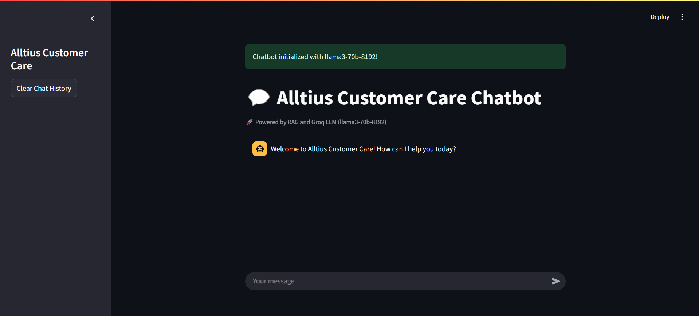
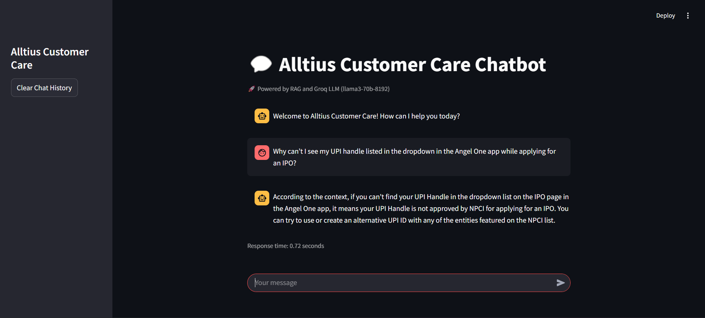

# Alltius Customer Care RAG Chatbot

A Retrieval Augmented Generation (RAG) based customer care chatbot powered by Groq's LLM models. This system provides answers to customer questions by retrieving relevant information from a knowledge base of support documents.

## Screenshots


_Chatbot initialized with llama3-70b-8192 model_


_Chatbot answering customer queries about UPI handles in IPO applications_

## Overview

This chatbot uses state-of-the-art language models from Groq combined with a RAG approach to provide accurate and contextual responses to customer inquiries. The system includes:

- Web scraping functionality to collect support documents from Angel One's website
- Document processing and embedding capabilities
- PDF extraction for handling PDF-based knowledge sources
- A conversational interface powered by Streamlit

## Technologies Used

- **LLM**: Groq's llama3-70b-8192 model
- **Embeddings**: HuggingFace sentence-transformers/all-mpnet-base-v2
- **Vector Store**: FAISS (Facebook AI Similarity Search)
- **RAG Framework**: LangChain
- **Web Interface**: Streamlit
- **Web Scraping**: BeautifulSoup4
- **Document Processing**: docx, PyPDF2
- **GPU Acceleration**: PyTorch (when available)

## Project Structure

```
alltius/
├── main.py                 # Streamlit web interface
├── requirements.txt        # Project dependencies
├── setup.py                # Package setup
└── src/
    └── RAG/
        ├── bot.py          # Chatbot implementation
        ├── combiner.py     # Data combination utilities
        ├── embedder.py     # Document embedding
        ├── pdfs_extractor.py # PDF extraction utilities
        ├── preprocess.py   # Data preprocessing
        ├── scrapper.py     # Web scraping module
        └── artifacts/      # Storage for documents and data
            ├── pdfs/       # PDF documents
            └── rag_data/   # Processed JSON data
        └── embedded_data/  # Vector embeddings
            ├── index.faiss # FAISS index
            └── index.pkl   # Metadata pickle file
```

## Setup Instructions

### 1. Prerequisites

- Python 3.12 or higher
- CUDA-capable GPU (optional, for faster embedding)

### 2. Installation

Clone the repository and install dependencies:

```bash
git clone https://github.com/yourusername/alltius.git
cd alltius
pip install -r requirements.txt
pip install -e .  # Install package in development mode
```

### 3. API Keys

Create a `.env` file in the root directory with your API keys:

```
GROQ_API_KEY=your_groq_api_key_here
```

### 4. Data Collection (Optional)

If you want to scrape new data from Angel One support:

```bash
python -m src.RAG.scrapper
```

### 5. Process Documents (Optional)

If you have PDF documents to process:

```bash
python -m src.RAG.pdfs_extractor
```

### 6. Generate Embeddings

Process and embed the collected documents:

```bash
python -m src.RAG.embedder
```

## Running the Chatbot

Start the Streamlit interface:

```bash
streamlit run main.py
```

The web interface will be available at http://localhost:8501

## Features

- **Conversational Interface**: User-friendly chat interface
- **Source Attribution**: Provides sources for information in responses
- **Context Retention**: Maintains conversation history
- **Document Search**: Searches through embedded documents to find relevant information
- **GPU Acceleration**: Uses GPU for embedding when available

## Usage Examples

1. Ask questions about Angel One support topics
2. Query information from embedded documents
3. Get help with account-related queries
4. Learn about financial procedures and requirements

## Troubleshooting

- **Missing Embeddings**: Ensure that the embedding process has completed successfully
- **GPU Issues**: If you encounter GPU errors, try setting `use_gpu=False` in the DocumentEmbedder class
- **API Rate Limits**: Be mindful of Groq API rate limits during heavy usage

## License

MIT License

## Contributors

Rahul A Gowda
